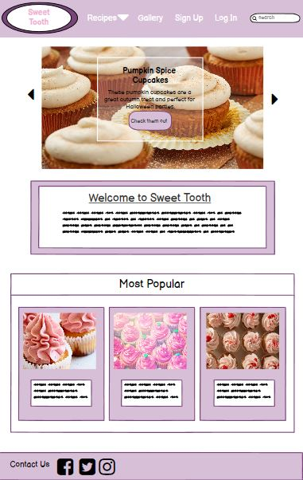
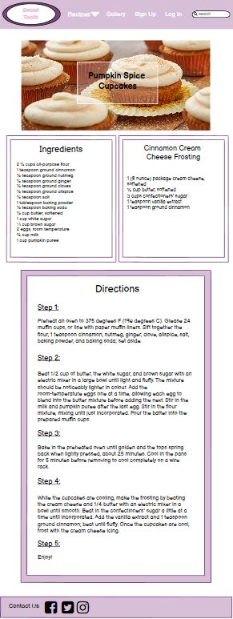
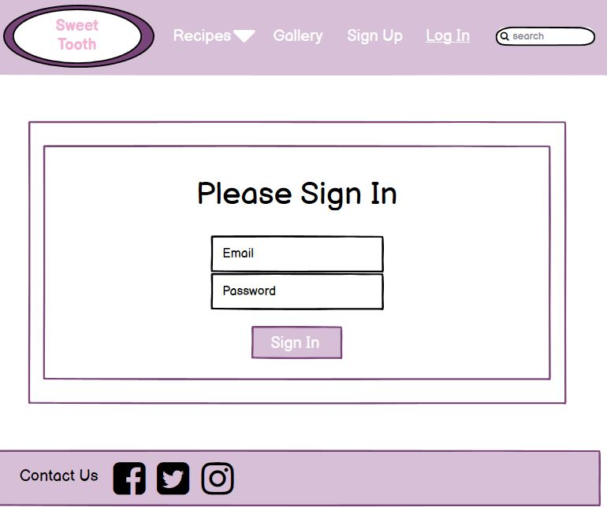
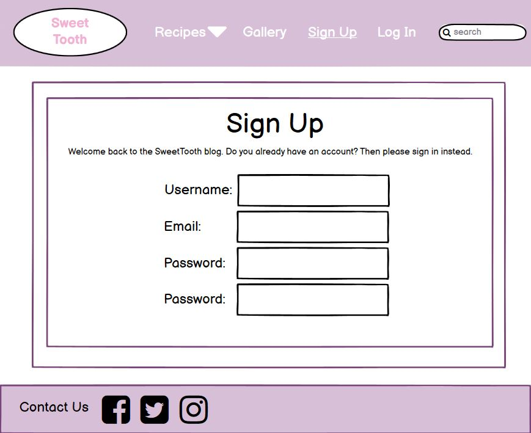
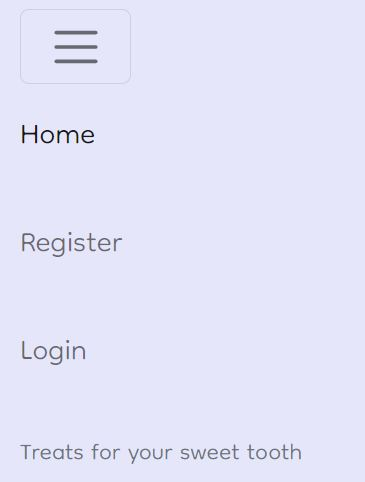
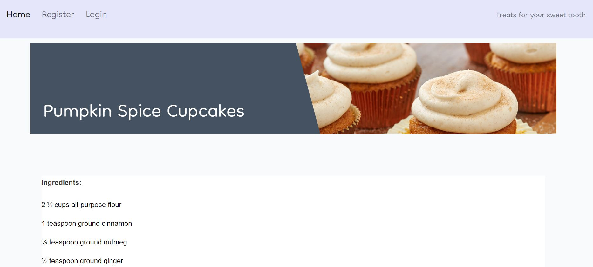
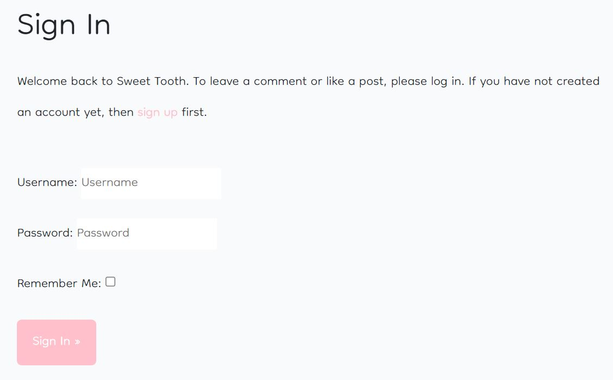
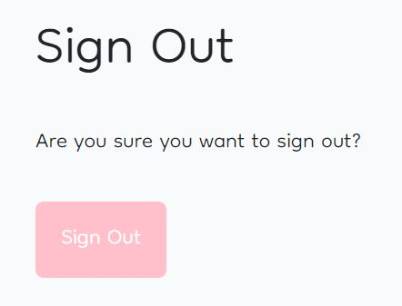
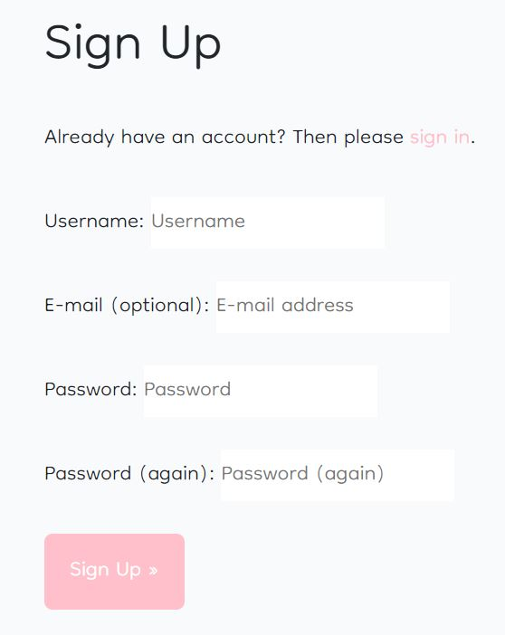
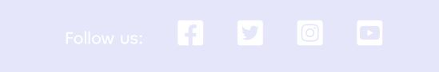

# Sweet Tooth

Due to unforeseen circumstances I had to completely restart this project last minute, this website is still very basic and full of minor errors. My sincere apologies for the fact that this is incomplete and is still a work in progress but I decided I wanted to submit something rather than nothing at all.

User Experience
======

### Target Audience
<ul> 
<li>People looking to expand their recipe library</li>
<li>Baking enthusiasts looking for inspiration and ideas</li>
<li>People passionate about baking that would like somewhere to share their thoughts and creations</li>
</ul>

### User Requirements
<ul>
<li>Links and functions that work as expected</li>
<li>A simple and efficient navigation system, suitable for any age</li>
<li>Bright and eye-catching presentation</li>
<li>Good accessibility</li>
<li>High quality photos</li>
<li>A trustworthy source of information</li>
</ul>

### User Stories

#### First-time User 
<ul>
<li>I want to register an account and log in or out as I please</li>
<li>I want to browse and submit recipes</li>
<li>I want to be able to leave comments on recipes</li>
<li>I want to use the navigation bar so that I can easily navigate to different pages</li>
</ul>

#### Returning User
<ul>
<li>I would like to keep track of my favourite recipes</li>
<li>I would like to see a wider variety of baking recipes</li>
<li>I would like to be able to interact with the baking community through the website</li>
<li>I would like to be able to provide feedback about the site and submit any suggestions I might have that I would like to see added to the site</li>
</ul>

Design
======

### Structure

The site is designed and structured in a way that is user friendly, easy to navigate and eye-catching. Upon clicking into the site, the user is greeted with the home page where all of the recipe posts will be gathered.

### Color

For the colour scheme a light pink and lavender colour were chosen because they compliment each other in an attractive way

After deciding on the colour I tested them on WebAIM to make sure the contrast between them was right
 

### Typography

The Dongle font was used for the text throughout this site. The font was found on Googlefonts and it was used because it was easy to read and looks appealing

### Wireframes

Homepage

Recipe page

Sign In page

Sign Up page

Features
======

### Navigation Bar
<ul>
<li>Featured on all webpages</li>
<li>Aids visitors in accessing information</li>
<li>Utilizes hyperlinks to navigate visitors</li>
</ul>

### Home Page
<ul>
<li>Displays the main focus of the site which is to showcase recipes and posts from bakers around the community</li>
<li>Piques the interests of visitors to give them a overall impression of what the site is for</li>
</ul>

### Sign In/Out
<ul>
<li>Allows user to sign in our out of their accounts</li>
</ul>

### Register
<ul>
<li>Allows people who view the site to create an account which lets them make their own posts and like/comment on others</li>
</ul>

### Footer
<ul>
<li>Featured on all pages</li>
<li>Consists of links to the main social media platforms</li>
</ul>

### Future features to implement
<ul>
<li>Plans to create a gallery for users to upload pictures of their own creation</li>
<li>Plans to create a page where all of the recipes uploaded can be found and categorised</li>
<li>Plans to include a search bar to find indiviudal recipes</li>
</ul>

Technologies Used
======

### Languages

<ul>
<li>HTML</li>
<li>CSS</li>
<li>Javascript</li>
<li>Python</li>
</ul>

### Frameworks & Tools

<ul>
<li>Balsamiq</li>
<li>Git</li>
<li>GitHub</li>
<li>Gitpod</li>
<li>Google Fonts</li>
<li>Django</li>
<li>PostgreSQL</li>
<li>Bootstrap v5.0</li>
<li>Favicon.io</li>
</ul>

Testing
======

### Html
W3C Markup Validation was used to validate the HTML of the website. The validator shows some errors linked to Javascript but when validating just the HTML it passes with no errors.

### Css
W3C Jigsaw CSS Validation was used to validate the CSS of the website. The validator shows some errors linked to Bootstrap v5.0 but when validating just my custom CSS it passes with no errors.

### JavaScript
JSHint Static Code Analysis Tool for JavaScript was used to validate the Javascript files. No significant issues were found.

Errors
======

The main errors I faced were with the missing module docsctring and class docstring in Pylint

Another error was the line is too long error which I unfortunately couldn't fix as using line break distrupted the code

These errors in the code have not affected functionality

Deployment
======

The website was deployed using Heroku using the following steps:

Use the "pip freeze -> requirements.txt" command in the terminal

Create a Heroku account

Click the New button in the upper right corner and select "create new app"

Choose a unique app name, region and click "Create app"

Go to the Settings tab, add the heroku/python buildpack

Go to the "deploy" tab and pick GitHub as a deployment method

Search for a repository to connect to

Go to the manual deploy section and click the "Deploy Branch" button

Wait for the app to build and then click on the "View" link

The live link can be found here - https://sweet-tooth-app.herokuapp.com/

Credits
======

### Content and Media

https://www.bakingmad.com

https://www.odlums.ie

https://www.bbcgoodfood.com

https://www.bbc.co.uk/food

https://github.com/Code-Institute-Solutions/Django3blog

### Acknowledgements

While making this project, I heavily relied on the tutorials provided by Code Institute, specifically the Django Blog tutorial
I would like to thank my mentor and tutor for continuous helpful feedback